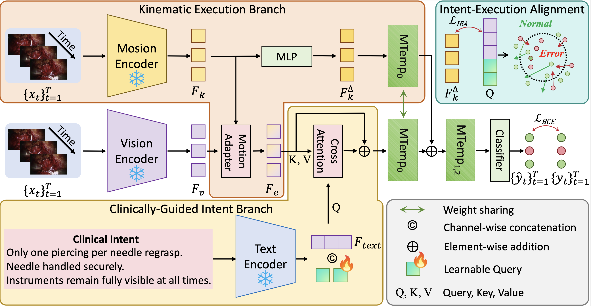

# KIDA: Kinematic-Intent Dual-path Alignment for Surgical Error Detection

<p align="center">
  
</p>

This repository contains the official implementation of KIDA (Kinematic-Intent Dual-path Alignment), a novel framework for detecting subtle, execution-level errors in Robotic-Assisted Surgery (RAS).

Automated Surgical Error Detection (SED) is critical for intraoperative patient safety and objective skill assessment. While major errors are visually apparent, subtle execution-level errors (e.g., improper motion control, unstable manipulations) often resemble normal maneuvers, posing a significant challenge for reliable detection. To address this visual ambiguity, KIDA reformulates SED from a purely appearance-driven discrimination to measuring the consistency between physical execution and clinically grounded intent. 

The framework consists of three core components:
* **Kinematic Execution Branch (KEB)**: Leverages lightweight kinematic motion dynamics (optical flow) to provide fine-grained physical modeling and subtle execution details about the ongoing surgical action.
* **Clinically-Guided Intent Branch (CIB)**: Utilizes semantic intent derived from clinical textual descriptions to dynamically evaluate whether the ongoing execution conforms to the intended standard maneuver.
* **Intent-Execution Alignment (IEA)**: An optimization strategy that explicitly enforces consistency for normal actions while actively decoupling subtle errors from the semantic intent to enlarge the feature margin.

---

## Content
* [1. Concrete Results](#1-concrete-results)
* [2. Codes and Models](#2-codes-and-models)
  * [Repository Structure](#repository-structure)
  * [Environments and Dataset](#environments-and-dataset)
  * [Training](#training)
  * [Inference](#inference)

---

## 1. Concrete Results

KIDA achieves State-of-the-Art (SOTA) results on the SAR-RARP50 dataset, demonstrating superior discrimination of subtle execution-level errors.

**Table 1. Performance comparison on the SAR-RARP50 dataset.**

| Method | All Test Data (AUC %) ↑ | All Test Data (AP %) ↑ | Short Errors (<3s) (AUC %) ↑ | Short Errors (<3s) (AP %) ↑ | Long Errors (≥3s) (AUC %) ↑ | Long Errors (≥3s) (AP %) ↑ |
| :--- | :---: | :---: | :---: | :---: | :---: | :---: |
| TECNO [5] | 58.14 ± 0.33 | 26.01 ± 0.32 | - | - | - | - |
| MS-TCN [6] | 58.82 ± 0.16 | 29.98 ± 3.06 | - | - | - | - |
| MS-TCN++ [11] | 58.57 ± 0.43 | 30.35 ± 1.35 | - | - | - | - |
| LSTM [12] | 68.43 ± 1.21 | 37.26 ± 2.65 | 60.00 ± 1.23 | 18.17 ± 1.57 | 79.25 ± 0.95 | 36.83 ± 1.68 |
| ASFormer [22] | 68.76 ± 0.93 | 36.79 ± 2.35 | 63.28 ± 0.77 | 25.13 ± 0.63 | 76.26 ± 0.42 | 33.61 ± 0.94 |
| Vim [23] | 69.06 ± 1.46 | 40.63 ± 2.30 | 62.57 ± 1.00 | 24.94 ± 0.28 | 77.18 ± 1.88 | 35.04 ± 4.48 |
| Mamba [8] | 69.38 ± 0.26 | 41.07 ± 0.95 | 63.17 ± 2.44 | 24.83 ± 3.67 | 74.17 ± 1.33 | 29.08 ± 1.41 |
| SEDMamba [21] | 71.20 ± 0.26 | 44.87 ± 1.52 | 62.24 ± 0.25 | 24.57 ± 0.21 | 79.57 ± 1.01 | 35.30 ± 1.52 |
| **Ours** | **73.48 ± 0.17** | **49.73 ± 0.29** | **63.82 ± 0.58** | **26.96 ± 1.42** | **82.29 ± 0.43** | **44.06 ± 1.80** |


**Table 2. Performance comparison on the JIGSAWS dataset.** *(COG is excluded from direct comparison as it utilizes additional gesture information).*

| Method | AUC (%) | AP (%) |
| :--- | :---: | :---: |
| COG [18] | 72.92 ± 2.87 | 75.02 ± 6.25 |
| SEDMamba [21] | 72.69 ± 2.67 | 74.16 ± 6.01 |
| **Ours** | **73.53 ± 2.88** | **74.73 ± 6.16** |

---

## 2. Codes and Models

### Repository Structure
The codebase is strictly organized for reproducibility:
```plaintext
KIDA/
├── KIDA.png                # Architecture diagram
├── environment.yml         # Main environment configuration (CUDA 11.8 + Mamba)
├── requirements_flow.txt   # Lightweight environment for optical flow extraction
├── checkpoints/            # Pre-trained model weights (e.g., best_model_weight.pth)
├── data/                   
│   ├── flow6d_test/        # 6D optical flow data for testing
│   ├── flow6d_train/       # 6D optical flow data for training
│   ├── test_emb_DINOv2/    # Visual features extracted via DINOv2 (.pkl)
│   ├── text_emb/           # Clinical textual embeddings (error_text_emb_p.pt)
│   └── train_emb_DINOv2/   # Visual features extracted via DINOv2 (.pkl)
├── dataset/                
│   └── dataload_KIDA.py    # Custom Video Dataset loader
├── mamba_ssm/              # Core Mamba State Space Model implementation
├── models/                 # KIDA core network architecture
│   ├── CIB.py              # Clinically-Guided Intent Branch
│   ├── IEA_loss.py         # Intent-Execution Alignment Loss calculation
│   ├── KEB.py              # Kinematic Execution Branch
│   └── KIDA_net.py         # Main framework & Temporal integration
├── scripts/                # Bash scripts for execution
│   ├── eval_sar.sh         # Script to evaluate the model
│   └── train_sar.sh        # Script to train the model
├── utils/                  # Utility functions
│   ├── metrics.py          # Metric calculation (AUC, AP)
│   ├── optical_flow.py     # Script to extract 6D optical flow from frames
│   └── text_encoder.py     # Script to encode clinical textual instructions
├── logger.py               # Custom logging utility
├── test.py                 # Testing and evaluation entry point
└── train.py                # Training entry point
````

### Environments and Dataset

#### 1. Installation

**Setup the Main Environment (KIDA Core):**

Due to the custom CUDA kernels required by State Space Models (`mamba-ssm` and `causal-conv1d`), standard pip installations may fail. We provide an `environment.yml` that automatically configures the strict CUDA 11.8 toolchain to ensure successful compilation.

For the double-blind review process, please download the repository as a ZIP file from the provided anonymous link and extract it:

Bash

```
unzip KIDA-4B4F.zip
cd KIDA-4B4F
conda env create -f environment.yml
conda activate kida
```

**Setup the Optical Flow Environment (Optional):**

To extract kinematic motion signals (optical flow) from raw video frames, we strongly recommend using a separate lightweight environment. This prevents version conflicts between modern OpenCV packages and the strict NumPy requirements of the main framework.

Bash

```
conda create -n kida_flow python=3.9 -y
conda activate kida_flow
pip install -r requirements_flow.txt
```

#### 2. Data Preparation

To keep the repository lightweight and self-contained for the review process, we have directly provided the extracted features (`.pkl`, `.npy`, `.pt`) in the `data/` directory. You can directly run the training and evaluation scripts with these features.

If you wish to extract features from scratch, please obtain the raw public resources:

1. **BioClinicalBERT Weights**: We utilize the official BioClinicalBERT model for semantic intent extraction. The weights can be automatically downloaded via the `transformers` library or manually obtained from the [official HuggingFace repository (`emilyalsentzer/Bio_ClinicalBERT`)](https://huggingface.co/emilyalsentzer/Bio_ClinicalBERT).
    
2. 2. **Raw Video Frames**: The original raw videos and surgical frames for the SAR-RARP50 dataset are officially hosted by the organizers. They can be requested and downloaded from the [UCL Research Data Repository](https://rdr.ucl.ac.uk/projects/SAR-RARP50_Segmentation_of_surgical_instrumentation_and_Action_Recognition_on_Robot-Assisted_Radical_Prostatectomy_Challenge/191091).
    

Ensure your `data/` directory matches the structure above before running:

- **Visual Features**: `data/train_emb_DINOv2/` and `data/test_emb_DINOv2/`.
    
- **Kinematic Features**: `data/flow6d_train/` and `data/flow6d_test/`.
    
- **Text Features**: `data/text_emb/`.
    

### Training

To train the KIDA framework from scratch, use the provided bash script:

Bash

```
bash scripts/train_sar.sh
```

Alternatively, you can run the Python script directly:

Bash

```
python train.py -exp "KIDA_SAR" -lr 0.0001 -bs 1 -e 120 -l 2e-5 -gpu_id "cuda:0"
```

### Inference

To evaluate a trained model and generate performance metrics (AUC, AP, including short/long breakdowns):

Bash

```
bash scripts/eval_sar.sh
```
